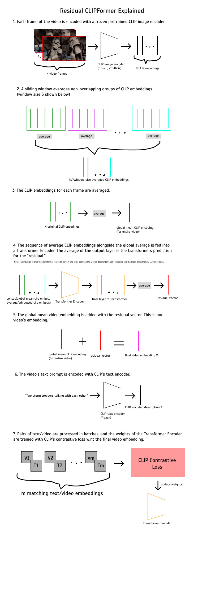

# Residual CLIPFormer: using CLIP embeddings for video search
Training a Transformer to create embeddings for videos in CLIP's latent space. This repo contains the code I used to train a model on top of a frozen CLIP encoder to achieve 45% recall@5 on [MSR-VTT](https://www.microsoft.com/en-us/research/publication/msr-vtt-a-large-video-description-dataset-for-bridging-video-and-language/) text-to-video retrieval. 

A simple live demo of this model can be accessed [here](http://daniel.mendelevitch.com:5000/); it's text-to-video retrieval on the entire MSR-VTT dataset, around 10k videos. Due to the small number of videos that can be retrieved, certain prompts might not exist in the dataset of videos, so the model performs best with more general prompts which are more likely to appear in MSR-VTT, like "driving a car" or "hiking through the woods." A prompt like "the three stooges driving a clown car" will probably not return any good results because there is no video in MSR-VTT matching that description.

An infographic of the technique used to train this model is below:

